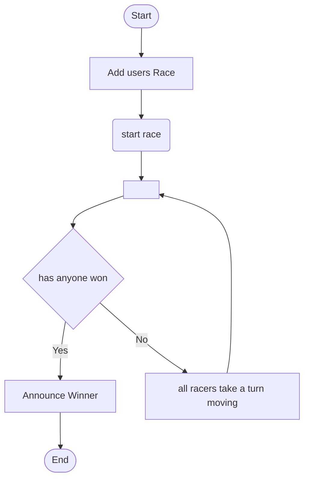
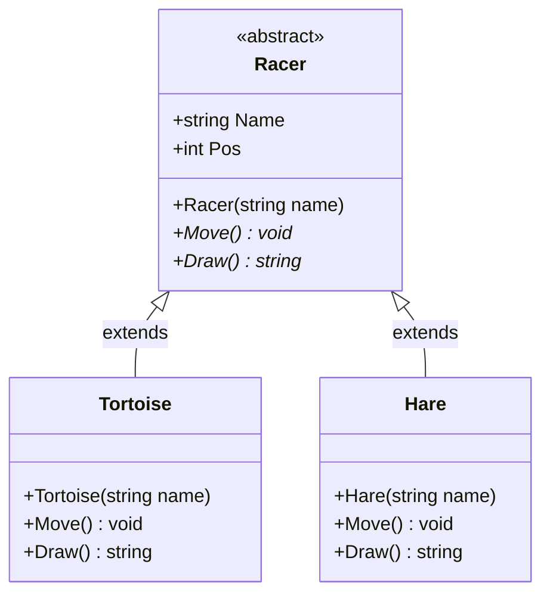
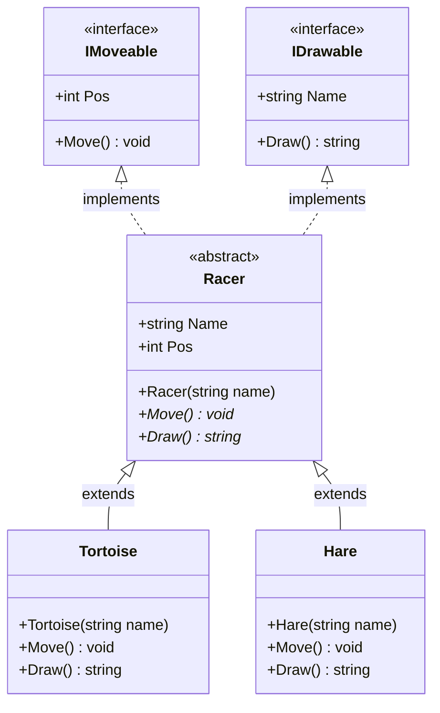
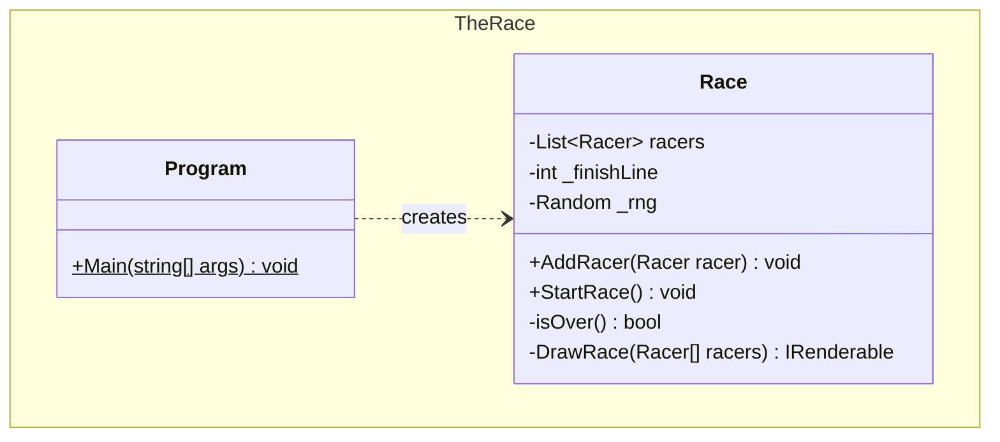

# The Race

The classic race between the Tortoise and the Hare. We have two designs, implemented in two different Libraries. I have made the Namespaces the same in the two libraries (normally not a good idea, but this is what allow us to just swap between the two libraries without making any other changes).

## Plod and Hop Table

move probabilities for Tortoises and Hares

| Animal   | name       | %    | move    |
| -------- | ---------- | ---- | ------- |
| Tortoise | Fast Plod  | 50   | +3 sq   |
|          | slip       | 20   | -6 sq   |
|          | slow plod  | 30   | +1 sq   |
| Hare     | Sleep      | 20   | no move |
|          | small hop  | 30   | +1 sq   |
|          | big hop    | 20   | +9 sq   |
|          | small slip | 20   | -2 sq   |
|          | big slip   | 10   | -12 sq  |

# Race Activity Diagram

This is the flow of control to run a race

1.  Create the Race object
   1. add racers 
   2. start the race
      1. has anyone won yet
         1. yes: announce the winner and exit the loop
         2. no: keep going
      2. move all the racers (one turn)
      3. draw the current state of the race
      4. repeat

---

### activity diagram: 

---

# Design using inheritance only

---

# Design using Interfaces

When we use interfaces instead of straight inheritance it changes the way we think of and organize our objects.  

- **Inheritance** encourages us to design classes as family trees. When we need to add a behaviours by creating new inherited classes with added functionality. 
  - This can be limiting, sometimes otherwise unrelated classes my require the same behavior
  - Family trees don't allow independent mixing and matching of behaviours
- **Interface** encourages us to design with more of a focus on capabilities. If a class implements an Interface it is saying that it has that capability (it can do the behaviour that the interface describes). 

---

# The Race app design

​	
